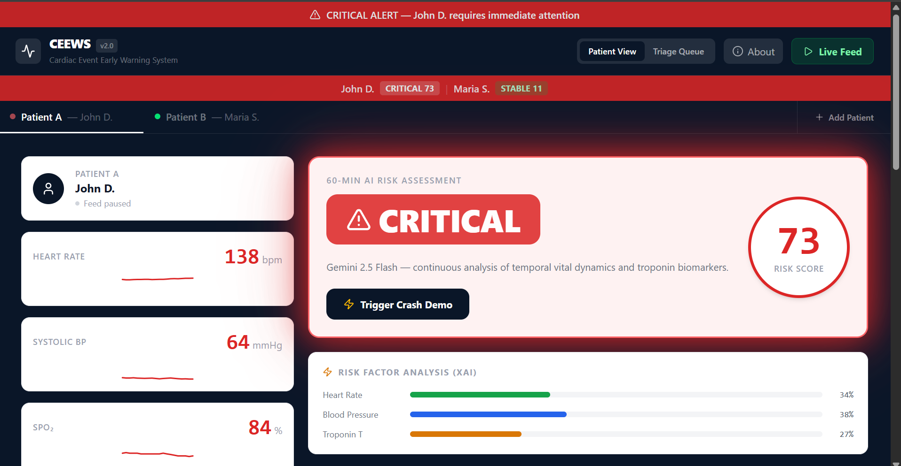

# CEEWS — Cardiac Event Early Warning System

> **Agentic AI that watches patient telemetry so ER doctors don't have to.**

[](https://er-cardiac-hackathon.web.app)
[](https://react.dev)
[](https://ai.google.dev)
[](https://firebase.google.com)

---

## The Problem

**Myocardial infarctions kill because they are caught too late.**

In a busy ER, a single nurse monitors up to six patients simultaneously. Telemetry alerts are noisy and threshold-based — they fire too late, after a trend has already become a crisis. By the time a physician reviews the data, the window for intervention has narrowed.

The first 60 minutes of chest-pain presentation are the most critical. Standard ICU software treats vitals as isolated snapshots. It never asks: *is this patient trending toward collapse?*

CEEWS does.

---

## Solution

CEEWS is a real-time agentic AI dashboard that:

1. **Continuously ingests** simulated patient telemetry (HR, BP, SpO₂, Troponin T) at 1.5-second intervals
2. **Calculates a live risk score** (0–99) by modeling the *rate of change* and *interaction* between biomarkers, not just static thresholds
3. **Consults Google Gemini 2.5 Flash** when the crash protocol is triggered, generating a full clinical assessment + prioritized action checklist in seconds
4. **Persists every assessment** to Firebase Firestore for the longitudinal record
5. **Surfaces everything in a clinical UI** designed for ER doctors under high stress — the risk level is unmissable at a glance

---

## Live Demo

**[https://er-cardiac-hackathon.web.app](https://er-cardiac-hackathon.web.app)**

Click **"Trigger Crash Demo"** on the dashboard to simulate hemodynamic collapse and watch Gemini respond with a full clinical advisory in real time.
## Screenshots


---

## Key Features

### Critical Status Visibility
The risk badge is the largest element on the dashboard — rendered at minimum 48px. A physician glancing at six screens can identify a critical patient in under two seconds.

| Level | Visual Treatment |
|---|---|
| **CRITICAL** | Pulsing red glow animation, red badge, red card border |
| **MODERATE RISK** | Persistent amber highlight |
| **STABLE** | Calm green — no alarm fatigue |

### AI Clinical Advisory
Every Gemini assessment is rendered as a structured clinical note:

```
Assessment — 14:32:05
"Patient presents with sinus tachycardia at 165 bpm accompanied by severe
hypotension at 72 mmHg systolic, consistent with cardiogenic shock. Markedly
elevated troponin at 0.18 ng/mL strongly suggests acute STEMI with imminent
hemodynamic collapse."
```

### Clinical Recommendations Panel
Below every assessment, a bordered **Clinical Recommendations** card renders Gemini's numbered action checklist — the single most actionable output in the system:

```
1. Obtain stat 12-lead ECG immediately
2. Draw troponin I / BNP labs and send STAT
3. Notify cardiology fellow on call
4. Prepare cath lab — STEMI protocol
5. Initiate vasopressor support if MAP < 65 mmHg
```

### Explainable AI (XAI) Risk Breakdown
The risk score is not a black box. A real-time bar chart shows each biomarker's *percentage contribution* to the current score, so clinicians understand exactly why the model is alarmed.

### Firestore Persistence
Every AI assessment is written to Firebase Firestore with timestamp, risk score, raw vitals, and clinical text — building a longitudinal record across the patient encounter.

---

## How Risk Scoring Works

The risk engine models three weighted factors with trend amplification:

```
hrWeight   = |HR − 75 bpm| × 1.2
bpWeight   = |120 − SystolicBP| × 1.5
tropWeight = (Troponin / 0.10) × 100
```

Trend multipliers apply when vitals are *worsening*:
- Heart rate rising rapidly → `hrWeight × 1.5`
- Blood pressure falling rapidly → `bpWeight × 1.8`

```
total     = hrWeight + bpWeight + tropWeight
riskScore = min(round((total / 300) × 100), 99)
```

| Score | Level |
|---|---|
| 0 – 29 | Stable |
| 30 – 69 | Moderate Risk |
| 70 – 99 | **Critical** |

This approach catches the *direction* of deterioration — a patient at 100 bpm trending to 130 bpm scores higher than a stable patient sitting at 115 bpm.

---

## Tech Stack

| Layer | Technology |
|---|---|
| Frontend | React 19, Vite |
| Styling | Tailwind CSS v4 |
| AI Inference | Google Gemini 2.5 Flash (`@google/genai`) |
| Database | Firebase Firestore (real-time `onSnapshot`) |
| Hosting | Firebase Hosting |
| Icons | Lucide React |

---

## Architecture

```
Browser
  └── React 19 (Vite)
        ├── Telemetry engine      — setInterval, 1.5s tick, state machine
        ├── Risk scoring engine   — pure function, runs each tick
        ├── XAI breakdown         — weight decomposition per biomarker
        ├── Gemini 2.5 Flash      — async call on trigger / crash demo
        │     └── Structured prompt → ASSESSMENT + RECOMMENDATIONS
        └── Firebase Firestore
              ├── addDoc on each assessment
              └── onSnapshot live query (last 5 records)
```

The entire system is stateless on the server side. All inference happens at the edge via the Gemini API; Firestore handles persistence. There is no backend to maintain.

---

## Running Locally

```bash
git clone https://github.com/YOUR_USERNAME/ceews.git
cd ceews
npm install
```

Add your keys to a `.env` file (or directly in `src/App.jsx` for demo purposes):

```env
VITE_GEMINI_API_KEY=your_gemini_key
VITE_FIREBASE_API_KEY=your_firebase_key
```

```bash
npm run dev
```

Open [http://localhost:5173](http://localhost:5173).

---

## Why This Matters

Acute MI is the leading cause of preventable death in emergency departments globally. The bottleneck is not treatment capability — it is **detection latency**. CEEWS demonstrates that a lightweight agentic AI system, built on commodity cloud infrastructure in a weekend, can meaningfully compress the time between "patient arrives" and "physician acts."

This is not a monitoring dashboard. It is an early warning system with a voice.

---

## License

MIT
